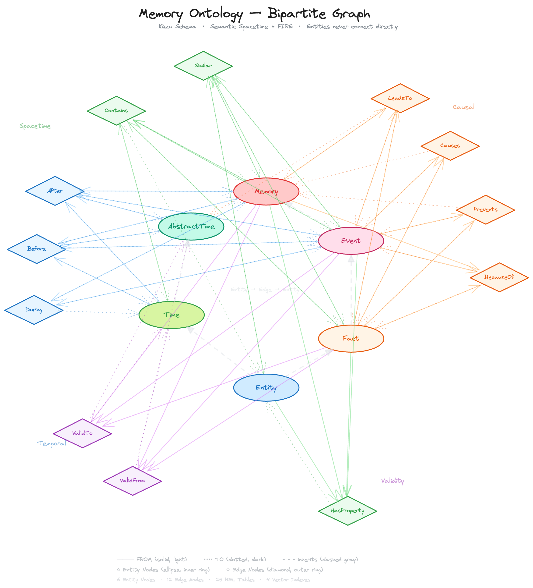

It is more hands on ladybugdb implementation of agentic **conversational memory** described im my book 

Link to book [Temporal Aware Memory](https://leanpub.com/time-aware-ai-memory)

I share a book chapter with [design](./memory-design.md)
Explanation of [schema](./memory-ontology-kuzu-v3.md)

Also schema has cypher files 

