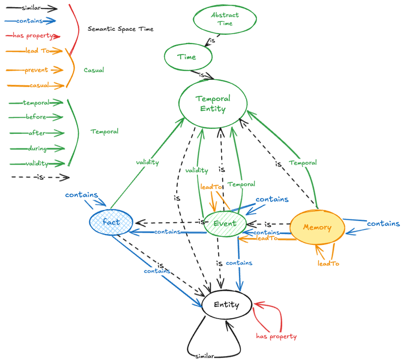
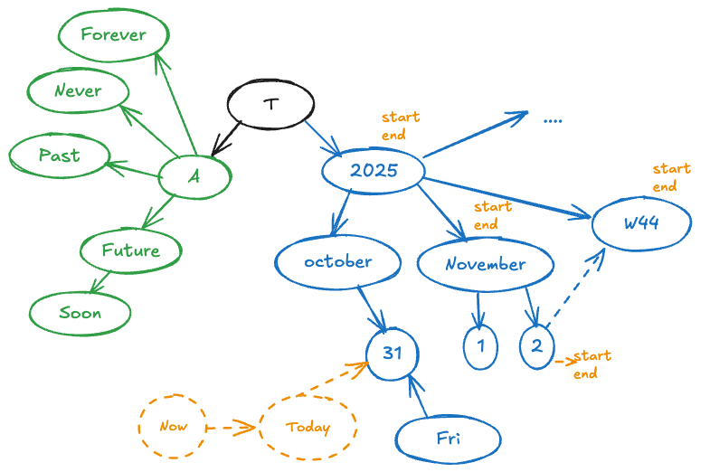

# Memory Design 

## The Time Tree - Modeling Temporal Ambiguity

## The Problem with Precise Timestamps

You probably remember the time tree concept from earlier in the book, but let me offer a quick refresher with some concrete illustrations. The fundamental challenge we face is this: quite often, you simply cannot use a precise timestamp because people don’t talk about time with precision.

Consider how temporal references actually work in natural language. Sometimes we have partial dates, like “next November” or “the 23rd of December.” Even that second example—which feels quite specific—is actually partial, because we’re missing the time of day. We have the date, but not the complete timestamp. Or we might say something even vaguer: “in the next month.” If I’m writing this in October 2025, that phrase connects to November 2025, but it’s inherently imprecise.

### Building the Hierarchy

To solve this problem of partial dates, we decided not to invent some magical string format. Instead, we made time instances into entities and created a hierarchy of abstract times. Each node in this hierarchy has a definite interval—we know when November starts and when November ends, just as we know the boundaries of individual dates.

We enriched this time tree with useful nodes beyond just months and dates. We added week numbers, weekday names, and other temporal components. The result is a rich structure that allows us to traverse time components quite effectively.

### Temporal Relations and Simplifications

We can also add rich and complex temporal relations to this structure: “next,” “previous,” “before,” “after,” and similar relationships. For the sake of simplification, I haven’t included all of these relations in the illustration—I’ve just kept the basic hierarchy visible.

### The Abstract Time Layer

As you can see in the diagram, we also have some subtle magic happening with abstract time that I’ll remind you about in the next chapter. There’s also a virtual node that I call “now,” which we can translate into at least a concrete day.

I suggest not extending the time tree down to hours, because it would become too huge to maintain effectively. I decided to stop at days because this still gives us great flexibility while keeping the structure manageable.

### Connecting to Real Entities

Finally, we can connect real entities and other objects to specific nodes in the time tree. These entities may have concrete timestamps as metadata when such precision exists. This approach gives us the best of both worlds: the ability to handle vague temporal references while still maintaining precise timestamps when we have them.

## The Ontology of Memory — Building a Semantic Foundation

### The Heart of the System: Understanding Ontology

The most fascinating aspect of this entire architecture is the ontology itself. At its core, the ontology defines what kinds of entities exist in the system and how they relate to one another. This is not merely a technical consideration—it’s the philosophical foundation upon which the entire memory system is built. The choices we make here ripple through every interaction, every query, and every piece of knowledge the system stores.

My inspiration came from the FIRE ontology, a well-established framework in knowledge representation that focuses on facts and events as fundamental building blocks. This approach resonated deeply with how human memory actually operates. We don’t remember raw data points; we remember things that happened, facts we learned, and experiences that shaped us. The FIRE ontology captures this intuition and formalizes it into a structure that computers can work with.

This approach centers on three primary concepts: facts, events, and entities. These aren’t arbitrary categories—they represent the fundamental ways we conceptualize information. Entities are the “things” in our world. Facts are the relationships and truths about those things. Events are the dynamic occurrences that unfold in time. Together, they form a complete semantic vocabulary for representing human experience and knowledge.

#### The Universal Entity: Foundation of Everything

The foundation is elegantly simple: practically everything in the system is an **entity**. An entity serves as the most abstract concept, a universal container from which all other types inherit. This might seem almost too simple at first glance, but therein lies its power. By establishing a single root concept, we create a unified system where everything shares common properties and can be manipulated through consistent interfaces.

Entities can take on a variety of types depending on the user’s domain, making the ontology highly extensible. A user working in medical research might define entities like “patient,” “symptom,” “treatment,” and “outcome.” A historian might work with entities like “historical figure,” “artifact,” “period,” and “location.” The beauty of the system is that it doesn’t prescribe these categories—it provides the framework for users to define what matters in their domain.

The ontology can be expanded with domain-specific ontologies tailored to particular fields of knowledge. It can also be enhanced with external ontologies developed by communities of experts. Researchers in biomedicine might import the Gene Ontology or Disease Ontology. Librarians might incorporate the Library of Congress Subject Headings. The system remains flexible and open, never forcing users into a rigid taxonomy that doesn’t match their mental models.

But regardless of how specialized these domain ontologies become, everything ultimately inherits from this base entity class. Think of it like object-oriented programming, where every object inherits from a root class—it’s the same principle here. In Java, everything extends Object. In Python, everything inherits from object. In this memory system, everything inherits from Entity. This provides a consistent interface for fundamental operations: every entity can be created, retrieved, updated, and deleted. Every entity can have properties, labels, and relationships. This consistency simplifies the underlying implementation while maintaining maximum expressiveness at higher levels.

#### Time: The Special Entity

Among all entities, **time** occupies a special position. Time is both an entity like any other and something fundamentally different—it provides the substrate upon which events unfold and memories form. Without a rich representation of time, we cannot capture the temporal nature of human experience.

Time constructs the nodes of what I call the “time tree,” which can represent both abstract and concrete temporal concepts. This tree structure captures the nested, hierarchical nature of how we think about time. Concrete time includes the familiar hierarchy: years contain months, months contain days, days belong to weeks, and so on. A specific moment—say, Tuesday, March 15, 2024, at 3:47 PM—sits at the leaf of this tree, connected through parent relationships to its week, month, year, and larger temporal units.

These concrete temporal nodes create a rich ontology that organizes our understanding of when things happen. They allow the system to answer questions like “What happened in March 2024?” or “Show me everything from that Tuesday” with precision. The tree structure makes temporal reasoning efficient—we can quickly find all events in a given month without scanning every event in the database.

But concrete timestamps are only part of how humans think about time. Abstract time is equally important, perhaps more so in daily use. Concepts like “future,” “past,” “soon,” “later,” “never,” “always,” “recently,” and “long ago” serve as atomic temporal nodes with their own semantics. These temporal abstractions allow the system to reason about time in human terms, not just as precise timestamps but as meaningful periods and relationships.

When someone says “I need to call Mom soon,” they’re not specifying a timestamp—they’re expressing a temporal intention with flexibility and context. The system needs to understand “soon” as a meaningful temporal concept, one that might mean “within the next few days” in this context. When planning future goals, someone might think about “someday” or “eventually”—vague temporal markers that nonetheless carry meaning and can be reasoned about.

The time tree also includes relative temporal concepts like “yesterday,” “tomorrow,” “next week,” and “last year.” These aren’t fixed points—they’re relative to the present moment and shift as time moves forward. Yet they’re essential to how we naturally express temporal relationships. The system maintains these relative temporal nodes alongside the absolute timeline, allowing for natural language understanding and generation.

This dual nature of time—both concrete and abstract, both precise and fuzzy—mirrors how human memory actually works. We remember some events with timestamp precision (“I graduated on June 15, 2010”) and others with temporal vagueness (“We used to go camping every summer when I was a kid”). Both types of temporal knowledge are valuable, and both find representation in the time tree.

### Facts: Where Entities Connect

- [ ] fact ilulstration

The complexity deepens when we introduce **facts**. In this system, a fact is a relational node—simultaneously a node in the graph and a representation of relationships between multiple entities. This dual nature is crucial to understanding how the system works. Facts aren’t stored separately from entities; they exist alongside them in the same graph structure, but they play a different semantic role.

Facts form the core of semantic memory, encoding our knowledge about how things relate to one another. Semantic memory, in cognitive science terms, is our repository of general knowledge about the world—facts, concepts, and relationships that aren’t tied to specific experiences of learning them. When you know that Paris is the capital of France, that’s semantic memory. You probably don’t remember the specific moment you learned this fact; you just know it.

Consider a simple example: “Berlin is the capital of Germany.” This statement involves three distinct entities—Berlin, the concept of capital, and Germany—but the fact itself is a complex node that binds these three entities together. We could represent this in different ways. We might create a fact node with three relationships: subject (Berlin), predicate (is-capital-of), and object (Germany). Or we might create a more complex structure that represents the full semantics of political capitals, including the temporal dimension (since capitals can change over time) and the type of governance relationship involved.

This is how the system glues entities into meaningful relationships. Without facts, we’d have a graph full of isolated nodes—entities floating without connection or context. Facts provide the connective tissue that transforms isolated entities into a web of knowledge. They encode not just that things exist, but how they relate, what roles they play, and what properties they possess.

#### The Architecture of Connection

Importantly, in this architecture, entities don’t connect directly to each other except in special cases. This is a deliberate design choice that might seem counterintuitive at first. In a traditional graph database, you’d simply create an edge labeled “capital-of” from Berlin to Germany. Why introduce the additional complexity of fact nodes?

The answer lies in the semantic richness we need to capture. Relationships in real-world knowledge aren’t simple binary edges—they’re complex structures with their own properties, contexts, and metadata. The fact that Berlin is Germany’s capital has temporal bounds (it wasn’t always true and might not always be true in the future). It has certainty levels (we’re 100% sure of this, unlike some historical facts that are disputed). It has sources (where did we learn this? Who claims it’s true?). It has relevance scores and connection strengths.

By making facts first-class nodes rather than simple edges, we can attach all this metadata directly to the relationship itself. We can also allow facts to participate in higher-order relationships—facts about facts, which become essential as we build more sophisticated knowledge structures.

Instead, relationships between entities must be represented through relational nodes—the facts themselves. This keeps the structure clean and maintains clear semantic boundaries. Every connection in the graph has explicit semantics captured in a fact node. We never have to wonder “what does this edge mean?” because the meaning is encoded in the node itself.

The graph remains simple: we have nodes and their relationships, but we avoid traditional graph edges in the conventional sense. The “edges” in this knowledge graph are actually nodes themselves, which keeps manipulation straightforward and consistent. We don’t need separate APIs for nodes and edges, separate storage structures, or separate reasoning algorithms. Everything is a node, just with different types and semantic roles. This uniformity simplifies implementation while enhancing expressiveness.

This approach also provides flexibility for future extensions. If we later decide we need to track additional metadata about relationships—say, confidence scores, source attributions, or temporal validity ranges—we don’t need to restructure the entire database. We simply add properties to the fact nodes. The architecture naturally accommodates growth and refinement.

#### Self-Referential Facts: Building Narratives

Here’s where things become truly powerful: **facts can reference other facts**. A fact is itself an entity, which means it can refer to or extend another fact. This self-referential capability might seem like a technical detail, but it’s actually the key to representing complex knowledge structures and narratives.

This creates chains or directed acyclic graphs (DAGs) of facts that can form larger composite facts or construct narrative structures. The DAG structure is important—it must be acyclic to prevent logical contradictions and infinite loops. A fact cannot ultimately depend on itself, though it can depend on other facts that together build toward more complex conclusions.

For example, consider the basic fact: “I am a software developer.” This is a simple fact about professional identity. But it’s rarely that simple in reality. We can extend this fact with additional detail: “I am a software developer since 2004.” The second fact builds upon the first, adding temporal context that changes its meaning. We’re not just stating a current profession—we’re establishing a long-term professional identity with specific temporal bounds.

We might extend it further: “I became a software developer after completing my computer science degree.” Now we’re building a causal chain—one fact leads to another. The degree completion is a prerequisite event that led to the professional identity. This chain can continue: “I pursued a computer science degree because I enjoyed programming as a teenager.” Each fact references or extends previous facts, building a rich narrative structure.

Through this self-referencing ability, the system can construct complex narratives and tell sophisticated stories. Human memory isn’t a collection of isolated facts—it’s a web of interconnected knowledge where each piece relates to others. The self-referential nature of facts captures this web-like structure naturally.

The concept of “contains” relationships is borrowed from magic spacetime links and other semantic systems, so we don’t need to reinvent these fundamental patterns. Researchers in knowledge representation have long recognized that facts can be compositional—built from smaller facts that combine into more complex structures. By adopting proven patterns from existing work, we ensure compatibility with established best practices and avoid reinventing wheels that have already been perfected through years of research.

This capability also enables the system to handle revisions and updates gracefully. If a fact changes, we don’t need to delete it—we can add a new fact that supersedes or modifies the old one. This preserves the historical record while updating current knowledge. For instance, “I was a software developer” might be superseded by “I am now a technical architect,” with an explicit relationship showing the transition. The system maintains both states and the relationship between them, providing a complete temporal view of evolving knowledge.

### Events: Facts That Happen

- [ ] event illustration 

**Events** represent a specialized subclass of facts. While all events are facts, not all facts are events. This distinction is crucial to understanding the different types of knowledge we store. A fact like “Berlin is the capital of Germany” describes a state of affairs, a relationship that holds (at least for now). An event like “Germany reunified in 1990” describes something that happened—a dynamic occurrence with temporal bounds.

An event is fundamentally a fact about something that happens, will happen, or even something that never happens. This last category might seem odd—how can something that never happens be an event? But in human reasoning, we often think about events that might have happened but didn’t, or events we expected that never occurred. “I never visited Paris” is meaningful information. “The predicted economic collapse didn’t happen” conveys important knowledge. The system needs to represent these non-occurrences alongside actual happenings.

Events capture the dynamic nature of experience—the things that occur in a user’s life, the changes and transitions that mark the passage of time. While facts describe timeless truths or slowly changing relationships, events are fundamentally temporal. They happen at moments, unfold over durations, and mark transitions from one state to another.

#### The Rich Structure of Events

Events inherit all the properties and relations of facts and entities, creating a rich inheritance hierarchy. This means every event has all the capabilities of facts—it can reference other events, extend them, participate in causal chains, and be composed into larger structures. It can also have all the basic properties of entities—labels, types, attributes, and membership in domain-specific ontologies.

But events also introduce temporal relations unique to their nature: they have start and end dates, marking their duration in time. Some events are instantaneous—“the bomb exploded” happens at a moment. Others unfold over durations—“the conference lasted three days” has clear start and end points. Still others have fuzzy temporal boundaries—“I lived in Berlin for several years” has imprecise endpoints that might be hard to pin down exactly.

The system accommodates all these temporal variations. It can store precise timestamps when available, but also represent temporal uncertainty and fuzziness. An event might have a start date of “sometime in 2015” with an end date of “before I moved to London.” This imprecision mirrors how human memory actually works—we often remember the rough temporal position of events without timestamp precision.

Events can express **causal relationships**—one event can lead to another or prevent something from happening. Causality is fundamental to how humans understand the world. We don’t just remember isolated events; we remember how one thing led to another, how our actions had consequences, how external events affected our plans. The system captures these causal links explicitly.

For example: “Getting accepted to university led to moving to a new city.” The acceptance event caused the relocation event. Or consider: “Leaving early for the airport prevented missing the flight.” Here we have a negative causality—an action that prevented an undesired outcome. Both positive and negative causal relationships are essential to reasoning about actions, plans, and consequences.

Causal chains can extend to arbitrary lengths. “I studied hard, which led to good grades, which led to college acceptance, which led to a career in engineering, which led to financial stability.” Each link in this chain represents a causal relationship between events. The system can traverse these chains to answer questions like “How did studying hard ultimately affect my career?” by following the causal links.

Events also support special temporal relations like “happens before,” “happens after,” and “happens during.” These relations are distinct from causality—one event can happen before another without causing it. “I graduated in 2010” happens before “I got married in 2015,” but the two events aren’t causally related. Yet the temporal relationship is still meaningful for reasoning about chronology and constructing timelines.

The “during” relationship captures temporal overlap. “I met my best friend during college” establishes that the meeting event occurred within the temporal bounds of the college attendance event, without specifying exactly when. This allows for useful queries like “What happened during my time in Boston?” that retrieve all events temporally contained within that period.

#### Events as Episodic Memory

This rich structure makes events the heart of **episodic memory**. In cognitive science, episodic memory refers to memory of specific experiences and events—the “movie” of your life that plays back when you remember things that happened to you. It’s distinct from semantic memory (general knowledge) and procedural memory (skills and habits).

While semantic memory consists primarily of facts—timeless knowledge about how things relate—episodic memory is built from events and their temporal organization. When you remember your first day of school, your wedding day, or what you had for breakfast this morning, you’re accessing episodic memory. These are specific occurrences that happened at particular times and places.

Events can contain facts as side effects or outcomes. “I graduated from university” is an event, but it has a factual consequence: “I hold a bachelor’s degree in computer science.” The event created a new fact—a change in state that persists beyond the event itself. Many events have such factual residues—outcomes that outlast the event and become part of our semantic knowledge.

Facts can also lead to events. “I discovered I was allergic to peanuts” is a fact that might lead to events like “I avoided eating that dessert” or “I bought an EpiPen.” Our knowledge influences our actions, and the system captures these connections between semantic and episodic memory.

This creates a web of causal relationships that mirrors how we actually experience and remember our lives. Memory isn’t neatly divided into separate boxes labeled “facts” and “events”—the two are intimately intertwined. Events produce facts. Facts influence events. The system models this natural integration rather than imposing artificial boundaries.

### Memories: The Pinnacle of Experience

- [ ] memory illustration 

At the highest level of abstraction, we find **memories**. A memory is simultaneously an event, a fact, and an entity—it inherits from the entire hierarchy. This places memories at the pinnacle of our ontological pyramid. They have all the capabilities of entities, all the relational structure of facts, and all the temporal and causal properties of events. But they represent something more—something qualitatively different.

However, not every event qualifies as a memory. This is a crucial distinction that reflects how human memory actually works. Throughout any given day, thousands of events occur. You stop at a red light, you check your email, you tie your shoes, you glance at the time. Most of these events are instantly forgotten or never consciously encoded in the first place. They aren’t memories—they’re just things that happened.

A memory represents a memorable user experience, something worth preserving and recalling. What makes an experience memorable? Psychology research suggests several factors: emotional intensity, personal significance, novelty, surprise, and connection to our goals and identity. Memories are the experiences that stand out from the routine flow of life, the moments that define us and shape our narratives.

#### The Composition of Memories

Consider the high-level memory “moving to Berlin.” This isn’t a single atomic event—it’s a complex experience that unfolded over time and involved multiple components. This single memory might contain multiple constituent events: finding a new job, securing an apartment, packing up belongings, saying goodbye to friends in the old city, the journey itself, arriving in Berlin, unpacking, exploring the new neighborhood, making new friends, and countless other experiences.

Each of these could be an event in its own right. “Found an apartment” is an event with a specific date and outcome. “Met my new neighbor Maria” is another event. But “moving to Berlin” as a memory encompasses all of these smaller events and binds them into a coherent narrative. It’s a container that provides structure and meaning to what would otherwise be a disconnected series of happenings.

Memories typically carry significance—they’re experiences the user genuinely wants to remember. This significance might be emotional (a wedding, a funeral, a moment of triumph or defeat), instrumental (important life transitions that changed one’s trajectory), or narrative (experiences that define who we are and how we tell our life story). The system allows users to mark certain experiences as memories worth preserving, distinguishing them from the endless stream of forgettable daily events.

They often include special contextual entities that explain why this memory matters, such as emotional context or personal meaning. A memory node might link to emotion entities: joy, anxiety, excitement, relief. It might connect to significance markers: “career milestone,” “relationship milestone,” “personal growth moment.” These contextual tags help the system understand why this particular experience is worth remembering and how it fits into the broader life narrative.

The system can also store reflections and interpretations alongside the raw events. The memory of “moving to Berlin” might include the thought “This was a turning point in my life” or “I felt both terrified and excited.” These meta-cognitive elements—thoughts about the experience rather than the experience itself—are crucial to how memories function. They’re what transform raw happenings into meaningful life experiences.

#### The Recursive Nature of Memory

Like facts and events, memories can contain other memories, creating a recursive structure. A memory can contain within it smaller memories, which themselves might contain even smaller ones. This mirrors how human autobiography is structured—we organize our lives into chapters, episodes, and nested narratives.

For instance, the memory “my twenties” might contain “college years,” “first job,” “living in Seattle,” and “learning to surf.” Each of these is itself a complex memory containing multiple events. “College years” contains “freshman orientation,” “declaring my major,” “study abroad semester,” and so on. This hierarchical nesting allows us to think about our lives at different levels of granularity.

I envision memories primarily using “contains” relationships rather than pure causal chains. While events might be linked primarily through causality (one event leads to another), memories are more about containment and composition. A memory is a container for multiple facts and events, aggregating them into coherent life experiences.

This distinction is important because it reflects different types of mental organization. When we think about causes and effects, we’re tracing chains through time: this led to that, which caused this other thing. When we think about memories, we’re often thinking about periods, episodes, or themes: this collection of experiences all belongs to my time in graduate school, or to my relationship with this person, or to my journey learning a skill.

These life experiences themselves form directed acyclic graphs (DAGs), allowing us to build even higher-level structures. We can create causal analyses or aggregated knowledge structures that provide analytical insights about memories. For instance, we might identify patterns: “All my career transitions involved a period of self-doubt followed by a breakthrough moment.” This pattern is a meta-memory—knowledge about the structure of memories themselves.

These meta-analyses can feed back into the reasoning engine, creating a self-improving system. By analyzing patterns in past memories, the system can better understand and predict future experiences. It might notice that certain types of events tend to lead to certain emotional outcomes, or that the user consistently finds particular types of experiences meaningful. This pattern recognition enables increasingly sophisticated assistance over time.

#### Why Separate Memories from Events?

The distinction between events and memories might seem like overkill—we could theoretically represent everything as events and use metadata to flag which ones are important. Why create a separate ontological category?

I believe it’s valuable to separate the raw events of life from the experiences a user truly wants to preserve. This separation serves several purposes:

First, it improves system performance and usability. If everything is just an event, then querying for “my important memories” requires filtering through potentially millions of trivial events. By marking certain event complexes as memories, we create a fast path for accessing what matters most.

Second, it reflects psychological reality. Human memory naturally distinguishes between remembered experiences (episodic memories) and forgotten events. Not everything that happens becomes a memory. By making this distinction explicit in the ontology, we align the system’s structure with cognitive reality.

Third, it enables different interaction patterns. When a user asks to “tell me about moving to Berlin,” they want the memory-level narrative—the high-level story with its emotional context and significance—not a chronological dump of every trivial event that occurred during that period. The memory/event distinction lets the system respond at the appropriate level of abstraction.

Finally, memories carry weight and meaning that ordinary events may lack. They’re not just things that happened; they’re experiences that shaped us. A memory has intentionality—it’s something we choose to remember, even if that choice happens unconsciously. By treating memories as a special category, we honor their significance and create space for the rich contextual information that makes them meaningful.

## Layered Visibility: Controlling Complexity

This ontological hierarchy enables a powerful **layered graph structure** that controls complexity through selective visibility. One of the great challenges in knowledge management is dealing with information at the right level of detail. Too much detail and you’re overwhelmed; too little and you miss important nuances. The layered approach solves this by letting users view the knowledge graph through different lenses.

You can view the knowledge graph at different levels of abstraction, each revealing different aspects of the stored knowledge:

### Layer 1: The Entity Layer

**Entity Layer**: Everything is visible—the complete graph of all entities and their relationships. This is the most detailed view, showing every node in the system regardless of type. When you need complete access to all available information, this layer provides it.

At this layer, you see not just memories, events, and facts, but also all the individual entities they reference: people, places, objects, concepts, time nodes, and everything else. You see the raw building blocks of knowledge in their full complexity.

This layer is useful for debugging, for comprehensive analysis, and for tasks that require complete information. If you’re trying to understand how something is represented in the system, or if you need to verify data integrity, the entity layer gives you full visibility.

However, this layer can be overwhelming. For a system storing years of memory and knowledge, the entity layer might contain millions of nodes. Without filtering and search, it’s too much to comprehend. That’s why we need higher abstraction layers.

###  Layer 2: The Fact Layer

**Fact Layer**: Only facts and higher abstractions are visible. Since events and memories are also facts (through inheritance), this layer filters out simple entities while preserving relational knowledge. You no longer see individual people, places, or objects in isolation—you only see facts that relate entities to each other.

This layer answers questions about relationships and states of affairs. “What do I know about Berlin?” at the fact layer retrieves all facts involving Berlin: “Berlin is the capital of Germany,” “Berlin is where I lived from 2018-2020,” “Berlin has a population of about 3.7 million,” and so on.

By hiding simple entities and showing only relational facts, this layer makes it easier to understand what you know rather than just what entities you’ve encountered. It’s the difference between a phone directory (list of entities) and a social graph (network of relationships).

The fact layer is particularly useful for semantic search and knowledge base queries. When you want to answer a factual question or understand relationships, you don’t need to see every entity—you need to see the facts that connect them.

### Layer 3: The Event Layer

**Event Layer**: Only events and memories remain visible. This view focuses on things that happen, hiding static factual knowledge to reveal the dynamic flow of experiences. At this layer, you’re viewing your life as a timeline of occurrences rather than a web of knowledge.

This is the episodic memory view. “What happened in 2023?” becomes a query over the event layer, retrieving all events (and memories) from that year. You see the narrative structure of your life—the story of what happened, when it happened, and how events connected to each other.

The event layer supports temporal reasoning and causal analysis. You can trace chains of causality: “Show me the events that led to my current job.” You can explore temporal patterns: “What did I typically do on weekends?” You can construct timelines and chronologies: “Give me a month-by-month summary of last year.”

By filtering out static facts and showing only dynamic events, this layer makes temporal reasoning much more efficient. The system doesn’t need to wade through timeless facts to find the things that happened—it works directly with the event subgraph.

### Layer 4: The Memory Layer

**Memory Layer**: The highest level, showing only memories—the experiences with meaning, emotional color, or personal significance that the user truly wants to preserve. This is the most selective and curated view of the knowledge graph.

At this layer, you’re not seeing every event that happened—just the memorable ones. You’re not seeing every fact you know—just the experiences that shaped you. This is the layer for reflection, reminiscence, and understanding your life story.

The memory layer answers questions like “What are my most important experiences?” or “Tell me about my life in Berlin” or “What shaped my career path?” It provides the high-level narrative structure without drowning in details.

This layer also supports emotional and psychological functions that other layers don’t. Looking at memories rather than events creates space for reflection on meaning and significance. It’s the difference between a calendar (events) and a journal (memories)—both are valuable, but they serve different purposes.

When working with mental health, personal growth, or life review, the memory layer is typically most appropriate. It focuses attention on experiences that matter rather than the routine flow of daily events.

### The Power of Layers

So it’s that you have the information about events and memories that have some meaning or emotional color or something that a user really wants to remember. This is the critical information for personal AI, for systems that need to understand not just what you know, but who you are.

These layers actually allow us to hide some level of details, apply different querying strategies, and optimize for different types of questions. A query that starts at the memory layer and finds nothing can automatically drop down to the event layer to look for more detail. A query that starts at the fact layer can reach down to the entity layer if needed.

The layers also enable different reasoning algorithms optimized for each level. Memory-level reasoning might focus on narrative coherence and emotional significance. Event-level reasoning might emphasize causal chains and temporal relationships. Fact-level reasoning might use logical inference and semantic networks. Entity-level reasoning might work with basic graph traversal and property matching.

This layered structure emerges automatically from node types, creating an elegant way to navigate information at the appropriate level of granularity. We don’t need to manually assign nodes to layers or maintain separate data structures—the layers are simply different views over the same underlying graph, filtered by ontological type.

When you need the big picture of a life, you examine memories. When you need to understand causality and what led to what, you study events. When you need factual knowledge and relationships, you query facts. And when you need the raw building blocks and complete detail, you work with entities.

This ontological framework creates a semantic foundation that mirrors how human memory actually works—layered, interconnected, rich with meaning, and organized at multiple levels of abstraction. It’s not just a technical architecture; it’s a computational model of how we remember, understand, and make sense of our lives.​​​​​​​​​​​​​​​​

##  Relations
Some people say that relations are more important than entities in an ontology. That’s not really true. Both of them are important, actually—the entities, the relations, the rules, the construction rules, and all the other components. The reasoning logic matters too. There are many parts in an ontology that are equally important, and we shouldn’t elevate one above the others.
Relations in a Graph Structure

In our case, we have a large graph, so we have many nodes that actually represent entities. We could duplicate facts if needed, and we could even arrange them in hierarchies—relations can be hierarchical, or they can be hyperlinked. But this structural flexibility isn’t the most crucial aspect, actually.
Think of these nodes as sandcastles: we could pick any central point and just grab the neighborhood around it and reconstruct something meaningful. The graph structure gives us that resilience and flexibility.
But What About Relations?
So what about relations themselves? Relations are crucial, particularly in knowledge graphs. We have these relation nodes between events, facts, and other entities. They form the connective tissue that gives our knowledge structure its meaning.
Let’s try to understand the relations landscape. I’ve already mentioned mind maps and concept maps—let’s call them ontology graphs. But now let’s try to dig a bit deeper into relations themselves and classify the relations, because relations are important. Maybe they’re not the most important thing—maybe they’re not more important than entities—but they’re still quite crucial for understanding.

### Extending Semantic Spacetime with Temporal Relations

As you can see, semantic space has four types of relations that are all quite descriptive and easy to understand. However, semantic spacetime somehow lacks precise temporal relations because time is viewed as part of space—they are consumed together. I propose extending the semantic spacetime concept with explicit temporal relations.

First of all, we need to identify the temporal entities in our system. I see time nodes and abstract time markers as temporal relations that we can refer to and use as anchors in our temporal navigation. I also consider events and even memories as temporal entities because they can serve as anchors or reference points, even when they lack concrete timestamps or time spans. We can view temporal entities as a parent class from which memory, event, and time all inherit. While they each have unique properties, let’s return to the core question of temporal relations.

What are temporal relations? We’ve already discussed that most temporal entities have two key moments: when the entity is articulated or begins, and when it expires or ends. In fact, roughly 80% of all temporal entities use what I call the “validity” relation. Validity is simply a form of temporal relation that marks both the beginning and the end, though the specific terminology varies depending on the entity type. For example, for facts, we might use “valid from” and “valid to,” while for events, we use “start” and “end.” It’s quite straightforward.

The validity concept becomes more complex when we consider continuous processes—events that are still ongoing. We need some form of abstract time marker to indicate that an event continues. There are multiple strategies for handling this. We could bind the end point to a node that says “now,” or we could bind it to an abstract time marker that says “in the future.” The choice depends on the semantics of what we’re describing. Alternatively, we could indicate that a process will never end by using an abstract time marker called “never” to denote something that will never happen or never conclude.

Beyond validity relations, we have additional temporal relations at our disposal. We can express that something happens before something else, after something else, or during another event. I believe these three relations—before, after, and during—describe the majority of temporal relationships we need to communicate.

For our purposes, let’s limit ourselves to validity relations (marking beginnings and endings) and the ability to express before, after, and during relationships between events. This framework will be sufficient to address the temporal dimension that has been completely missing from semantic spacetime models.​​​​​​​​​​​​​​​​

###  Extending Semantic Space time with extra Causality Relations

The beauty of semantic spacetime is that we already have causality relations—we have “leads to” and similar connections. These are quite simple, and in the majority of cases, they’re good enough. They show us how one event influences another. But to be honest, this framework lacks important details.

I can say that something happens or leads to an event, but I can also say that something *didn’t* happen or was *prevented* by some event. This is equally useful information. There are also probabilistic components and potential events that need to be reflected in the graph. For example, when considering future events, we may have causality relations that are probabilistic—perhaps with conditions, weighted probabilities, or other qualifications.

If we want to fully explore causality and probability of events, I would say we need to write a couple of extra chapters for this book, or better yet, start an entirely new one. These topics go beyond the scope of our discussion of time. Nevertheless, it’s still valuable to extend our vocabulary somewhat to include causality, probability, and potential events. It’s important to mark and distinguish these from events that have already occurred.

That’s why I propose adding at least a “prevented by” relation to extend what semantic spacetime currently offers. This simple addition allows us to capture not just what happened, but also what *didn’t* happen—and why. While a complete treatment of probabilistic causality awaits future work, even this modest extension significantly enriches our ability to model temporal reality.​​​​​​​​​​​​​​​​

## Cognitive Processes 

- [ ] cognitive processes 
### Extraction 
  - [ ] Extraction 
### Consolidation
  - [ ] Consolidation 
### Soon and future Processing 
  - [ ] Soon & future processing 
### Event Aggregation 
  - [ ] Event aggregation 
### Causality 
  - [ ] Causality analisys 

