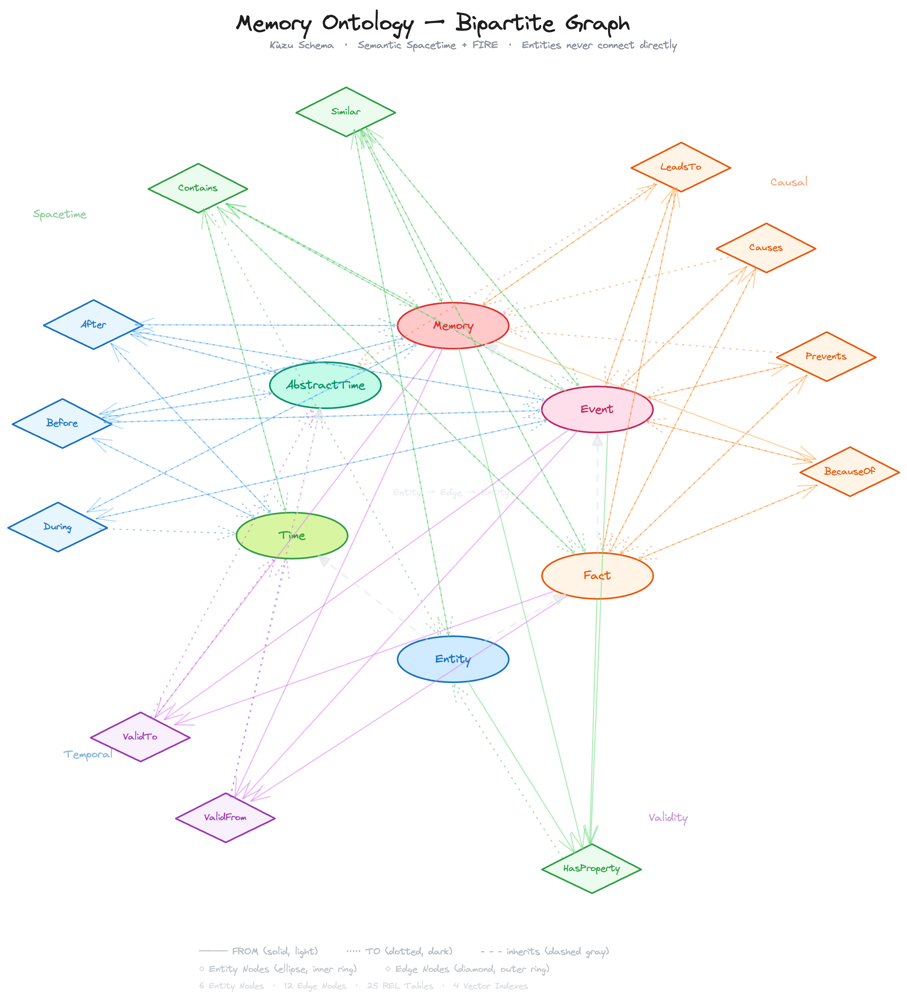
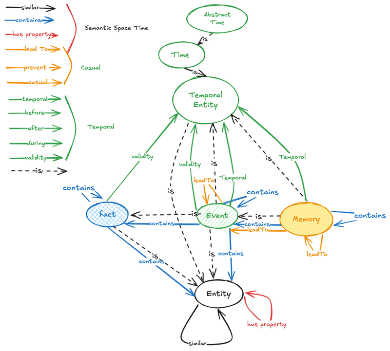

# Memory Ontology — LadybugDB Schema

**Bipartite Graph with Dedicated Typed Edge Nodes**
Semantic Spacetime + FARO-inspired Memory Ontology




Simplified ontology view 



---

## Design Principles

1. Every concept is a node — entities never connect directly
2. Dedicated typed edge node tables with domain-specific properties
3. **Polymorphic REL tables** — one `FROM` and one `TO` per edge node type, listing all valid source/target entity tables
4. Relation constraints derived from the ontology diagram — only semantically valid pairs are wired
5. Every node carries universal columns: label, labelResolved, labelEmbedding[518], temporal block, layer, context
6. **Dual-storage**: Conversations and messages live in DuckDB (relational) and are projected into the graph as node tables — enabling both efficient relational queries and graph traversal

---

## Inheritance Hierarchy (via tables, not edges)

### Entity Nodes

```
Entity
  ├── Time
  │     └── AbstractTime
  └── Fact
        └── Event
              └── Memory
```

### Conversational Nodes (DuckDB-projected, layer = -1)

```
Conversation
  └── Message
```

These live as relational tables in DuckDB and are projected into Kùzu as node tables via `ATTACH`. They sit below the entity layer (layer = -1) as raw observational data from which entities, facts, events, and memories are extracted.

### Relation Nodes (Edge Node Tables, layer = 0)

All relation nodes share the universal columns. Grouped by semantic category:

```
RelationNode  (universal: label, label_resolved, learned_at, expire_at, created_at, updated_at, layer=0, context)
  ├── Spacetime
  │     ├── Contains      (containment_type, weight)
  │     ├── Similar       (similarity, sim_context, sim_method)
  |     ├── LeadsTo       (probability, strength, mechanism)
  │     └── HasProperty   (property_name, property_value, prop_context, certainty)
  ├── Provenance
  │     └── Source        (extraction_method, confidence, fragment)
  ├── Causal
  │     ├── Prevents      (probability, strength, mechanism)
  │     ├── Causes        (probability, strength, mechanism, directness)
  │     └── BecauseOf     (probability, strength, explanation)
  ├── Temporal
  │     ├── Before        (gap_duration, confidence)
  │     ├── After         (gap_duration, confidence)
  │     └── During        (overlap_type, confidence)
  └── Validity
        ├── ValidFrom     (precision, confidence)
        └── ValidTo       (precision, confidence, termination)
```

---

## Universal Node Columns

Present on **every** node table (entity and edge nodes alike):

```
label            STRING              -- raw label as extracted
label_resolved   STRING              -- canonicalized / disambiguated
learned_at       TIMESTAMP           -- when the system first learned this
expire_at        TIMESTAMP           -- when this knowledge expires
created_at       TIMESTAMP           -- record creation
updated_at       TIMESTAMP           -- last modification
layer            INT16               -- 0=EdgeNode, 1=Entity, 2=Fact, 3=Event, 4=Memory
context          STRING              -- free-text situational context
```

Additionally, **content node tables only** (Entity, Fact, Event, Memory) carry:

```
label_embedding  FLOAT[518]          -- embedding vector for semantic search
```

---

## Part 1: Entity Node Tables

### Entity

```cypher
CREATE NODE TABLE Entity (
    id               STRING PRIMARY KEY,
    // universal
    label            STRING,
    label_resolved   STRING,
    label_embedding  FLOAT[518],
    learned_at       TIMESTAMP,
    expire_at        TIMESTAMP,
    created_at       TIMESTAMP,
    updated_at       TIMESTAMP,
    layer            INT16 DEFAULT 1,
    context          STRING
);
```

### Time

```cypher
CREATE NODE TABLE Time (
    id               STRING PRIMARY KEY,
    granularity      STRING,
    starts_at        TIMESTAMP,
    ends_at          TIMESTAMP,
    // universal
    label            STRING,
    label_resolved   STRING,
    learned_at       TIMESTAMP,
    expire_at        TIMESTAMP,
    created_at       TIMESTAMP,
    updated_at       TIMESTAMP,
    layer            INT16 DEFAULT 1,
    context          STRING
);
```

### AbstractTime

```cypher
CREATE NODE TABLE AbstractTime (
    id               STRING PRIMARY KEY,
    semantics        STRING,
    // universal
    label            STRING,
    label_resolved   STRING,
    learned_at       TIMESTAMP,
    expire_at        TIMESTAMP,
    created_at       TIMESTAMP,
    updated_at       TIMESTAMP,
    layer            INT16 DEFAULT 1,
    context          STRING
);
```

### Fact

```cypher
CREATE NODE TABLE Fact (
    id               STRING PRIMARY KEY,
    predicate        STRING,
    certainty        DOUBLE DEFAULT 1.0,
    source           STRING,
    // universal
    label            STRING,
    label_resolved   STRING,
    label_embedding  FLOAT[518],
    learned_at       TIMESTAMP,
    expire_at        TIMESTAMP,
    created_at       TIMESTAMP,
    updated_at       TIMESTAMP,
    layer            INT16 DEFAULT 2,
    context          STRING
);
```

### Event

```cypher
CREATE NODE TABLE Event (
    id               STRING PRIMARY KEY,
    predicate        STRING,
    certainty        DOUBLE DEFAULT 1.0,
    source           STRING,
    status           STRING DEFAULT 'occurred',
    is_ongoing       BOOLEAN DEFAULT FALSE,
    // universal
    label            STRING,
    label_resolved   STRING,
    label_embedding  FLOAT[518],
    learned_at       TIMESTAMP,
    expire_at        TIMESTAMP,
    created_at       TIMESTAMP,
    updated_at       TIMESTAMP,
    layer            INT16 DEFAULT 3,
    context          STRING
);
```

### Memory

```cypher
CREATE NODE TABLE Memory (
    id               STRING PRIMARY KEY,
    predicate        STRING,
    certainty        DOUBLE DEFAULT 1.0,
    source           STRING,
    status           STRING DEFAULT 'occurred',
    is_ongoing       BOOLEAN DEFAULT FALSE,
    significance     STRING,
    emotions         STRING[],
    reflection       STRING,
    // universal
    label            STRING,
    label_resolved   STRING,
    label_embedding  FLOAT[518],
    learned_at       TIMESTAMP,
    expire_at        TIMESTAMP,
    created_at       TIMESTAMP,
    updated_at       TIMESTAMP,
    layer            INT16 DEFAULT 4,
    context          STRING
);
```

---

## Part 1b: Conversational Layer — DuckDB Tables Projected as Node Tables

Conversations and messages are the raw observational substrate from which knowledge (entities, facts, events, memories) is extracted. They live as **relational tables in DuckDB** for efficient append, pagination, and full-text search, and are **projected into Kùzu as node tables** so they participate in graph traversal.

### DuckDB Schema

```sql
-- DuckDB relational tables (source of truth for conversational data)

CREATE TABLE conversations (
    id               VARCHAR PRIMARY KEY,
    title            VARCHAR,
    started_at       TIMESTAMP NOT NULL DEFAULT CURRENT_TIMESTAMP,
    ended_at         TIMESTAMP,
    participant      VARCHAR,              -- 'user'|'assistant'|'pair'|'group'
    model            VARCHAR,              -- LLM model identifier
    summary          VARCHAR,
    tags             VARCHAR[],
    created_at       TIMESTAMP NOT NULL DEFAULT CURRENT_TIMESTAMP,
    updated_at       TIMESTAMP NOT NULL DEFAULT CURRENT_TIMESTAMP
);

CREATE TABLE messages (
    id               VARCHAR PRIMARY KEY,
    conversation_id  VARCHAR NOT NULL REFERENCES conversations(id),
    role             VARCHAR NOT NULL,     -- 'user'|'assistant'|'system'|'tool'
    content          VARCHAR NOT NULL,
    content_embedding FLOAT[518],          -- embedding for semantic search over messages
    token_count      INTEGER,
    message_index    INTEGER NOT NULL,     -- ordering within conversation
    parent_message_id VARCHAR,             -- for branching conversations
    created_at       TIMESTAMP NOT NULL DEFAULT CURRENT_TIMESTAMP
);

-- Indexes for common access patterns
CREATE INDEX idx_messages_conversation ON messages(conversation_id, message_index);
CREATE INDEX idx_messages_role ON messages(conversation_id, role);
CREATE INDEX idx_conversations_time ON conversations(started_at DESC);
```

### Kùzu Projection — Attach and Project as Node Tables

```cypher
// Attach the DuckDB database
ATTACH 'memory.duckdb' AS duck (dbtype duckdb);

// Project DuckDB tables as Kùzu node tables
CREATE NODE TABLE Conversation (
    id               STRING PRIMARY KEY,
    title            STRING,
    started_at       TIMESTAMP,
    ended_at         TIMESTAMP,
    participant      STRING,
    model            STRING,
    summary          STRING,
    tags             STRING[],
    // universal
    label            STRING,
    label_resolved   STRING,
    learned_at       TIMESTAMP,
    expire_at        TIMESTAMP,
    created_at       TIMESTAMP,
    updated_at       TIMESTAMP,
    layer            INT16 DEFAULT -1,
    context          STRING
);

CREATE NODE TABLE Message (
    id               STRING PRIMARY KEY,
    conversation_id  STRING,
    role             STRING,
    content          STRING,
    content_embedding FLOAT[518],
    token_count      INT32,
    message_index    INT32,
    parent_message_id STRING,
    // universal
    label            STRING,
    label_resolved   STRING,
    learned_at       TIMESTAMP,
    expire_at        TIMESTAMP,
    created_at       TIMESTAMP,
    updated_at       TIMESTAMP,
    layer            INT16 DEFAULT -1,
    context          STRING
);
```

### Layer Semantics

| Layer | Meaning | Tables |
|-------|---------|--------|
| **-1** | Raw conversational data (DuckDB-projected) | Conversation, Message |
| **0** | Edge/relation nodes | Contains, Source, Similar, ... |
| **1** | Entities and time | Entity, Time, AbstractTime |
| **2** | Facts | Fact |
| **3** | Events | Event |
| **4** | Memories | Memory |

Knowledge flows **upward**: messages (layer -1) are processed to extract entities (1), facts (2), events (3), and memories (4). The `Source` relation tracks this provenance chain.

---

## Part 2: Dedicated Typed Edge Node Tables

### Contains — Compositional / Membership

From ontology: Conversation→Message, Message→{Entity,Fact,Event,Memory}, Memory→{Event,Fact,Entity,Memory}, Event→{Fact,Entity,Event}, Fact→{Entity,Fact}, Time→Time

```cypher
CREATE NODE TABLE Contains (
    id               STRING PRIMARY KEY,
    containment_type STRING,              -- 'composition'|'membership'|'aggregation'|'part_of'
    weight           DOUBLE DEFAULT 1.0,
    // universal
    label            STRING,
    label_resolved   STRING,
    learned_at       TIMESTAMP,
    expire_at        TIMESTAMP,
    created_at       TIMESTAMP,
    updated_at       TIMESTAMP,
    layer            INT16 DEFAULT 0,
    context          STRING
);
```

### Source — Provenance Attribution

From ontology: {Entity,Fact,Event,Memory}→Message. Tracks which message a piece of knowledge was extracted from. The edge points from the extracted knowledge back to its originating message.

```cypher
CREATE NODE TABLE Source (
    id               STRING PRIMARY KEY,
    extraction_method STRING,              -- 'llm'|'regex'|'ner'|'manual'|'tool'
    confidence       DOUBLE DEFAULT 1.0,
    fragment         STRING,               -- the relevant substring from the message
    // universal
    label            STRING,
    label_resolved   STRING,
    learned_at       TIMESTAMP,
    expire_at        TIMESTAMP,
    created_at       TIMESTAMP,
    updated_at       TIMESTAMP,
    layer            INT16 DEFAULT 0,
    context          STRING
);
```

### LeadsTo — Causal Forward

From ontology: {Event,Memory,Fact}→{Event,Memory,Fact}. Causal arrow primarily between temporal entities.

```cypher
CREATE NODE TABLE LeadsTo (
    id               STRING PRIMARY KEY,
    probability      DOUBLE DEFAULT 1.0,
    strength         DOUBLE DEFAULT 1.0,
    mechanism        STRING,
    // universal
    label            STRING,
    label_resolved   STRING,
    learned_at       TIMESTAMP,
    expire_at        TIMESTAMP,
    created_at       TIMESTAMP,
    updated_at       TIMESTAMP,
    layer            INT16 DEFAULT 0,
    context          STRING
);
```

### Prevents — Negative Causality

From ontology: {Event,Fact}→{Event,Fact,Memory}. Something blocked an outcome.

```cypher
CREATE NODE TABLE Prevents (
    id               STRING PRIMARY KEY,
    probability      DOUBLE DEFAULT 1.0,
    strength         DOUBLE DEFAULT 1.0,
    mechanism        STRING,
    // universal
    label            STRING,
    label_resolved   STRING,
    learned_at       TIMESTAMP,
    expire_at        TIMESTAMP,
    created_at       TIMESTAMP,
    updated_at       TIMESTAMP,
    layer            INT16 DEFAULT 0,
    context          STRING
);
```

### Causes — Direct Causation

From ontology: {Event,Fact}→{Event,Fact,Memory}. Stronger than LeadsTo.

```cypher
CREATE NODE TABLE Causes (
    id               STRING PRIMARY KEY,
    probability      DOUBLE DEFAULT 1.0,
    strength         DOUBLE DEFAULT 1.0,
    mechanism        STRING,
    directness       STRING DEFAULT 'direct',
    // universal
    label            STRING,
    label_resolved   STRING,
    learned_at       TIMESTAMP,
    expire_at        TIMESTAMP,
    created_at       TIMESTAMP,
    updated_at       TIMESTAMP,
    layer            INT16 DEFAULT 0,
    context          STRING
);
```

### BecauseOf — Reverse Causal Explanation

From ontology: {Event,Fact,Memory}→{Event,Fact}. "This happened because of that."

```cypher
CREATE NODE TABLE BecauseOf (
    id               STRING PRIMARY KEY,
    probability      DOUBLE DEFAULT 1.0,
    strength         DOUBLE DEFAULT 1.0,
    explanation      STRING,
    // universal
    label            STRING,
    label_resolved   STRING,
    learned_at       TIMESTAMP,
    expire_at        TIMESTAMP,
    created_at       TIMESTAMP,
    updated_at       TIMESTAMP,
    layer            INT16 DEFAULT 0,
    context          STRING
);
```

### Similar — Semantic Similarity

From ontology: Entity↔Entity (self-loop in diagram). Same-type comparison.

```cypher
CREATE NODE TABLE Similar (
    id               STRING PRIMARY KEY,
    similarity       DOUBLE DEFAULT 0.0,
    sim_context      STRING,
    sim_method       STRING,
    // universal
    label            STRING,
    label_resolved   STRING,
    learned_at       TIMESTAMP,
    expire_at        TIMESTAMP,
    created_at       TIMESTAMP,
    updated_at       TIMESTAMP,
    layer            INT16 DEFAULT 0,
    context          STRING
);
```

### HasProperty — Attribute Assignment

From ontology: Entity→Entity (property arrow on Entity self-loop).

```cypher
CREATE NODE TABLE HasProperty (
    id               STRING PRIMARY KEY,
    property_name    STRING,
    property_value   STRING,
    prop_context     STRING,
    certainty        DOUBLE DEFAULT 1.0,
    // universal
    label            STRING,
    label_resolved   STRING,
    learned_at       TIMESTAMP,
    expire_at        TIMESTAMP,
    created_at       TIMESTAMP,
    updated_at       TIMESTAMP,
    layer            INT16 DEFAULT 0,
    context          STRING
);
```

### Before — Temporal Ordering

From ontology: between temporal types {Event, Memory, Time, AbstractTime}

```cypher
CREATE NODE TABLE Before (
    id               STRING PRIMARY KEY,
    gap_duration     STRING,
    confidence       DOUBLE DEFAULT 1.0,
    // universal
    label            STRING,
    label_resolved   STRING,
    learned_at       TIMESTAMP,
    expire_at        TIMESTAMP,
    created_at       TIMESTAMP,
    updated_at       TIMESTAMP,
    layer            INT16 DEFAULT 0,
    context          STRING
);
```

### After — Temporal Ordering (Reverse)

```cypher
CREATE NODE TABLE After (
    id               STRING PRIMARY KEY,
    gap_duration     STRING,
    confidence       DOUBLE DEFAULT 1.0,
    // universal
    label            STRING,
    label_resolved   STRING,
    learned_at       TIMESTAMP,
    expire_at        TIMESTAMP,
    created_at       TIMESTAMP,
    updated_at       TIMESTAMP,
    layer            INT16 DEFAULT 0,
    context          STRING
);
```

### During — Temporal Containment

```cypher
CREATE NODE TABLE During (
    id               STRING PRIMARY KEY,
    overlap_type     STRING DEFAULT 'full',
    confidence       DOUBLE DEFAULT 1.0,
    // universal
    label            STRING,
    label_resolved   STRING,
    learned_at       TIMESTAMP,
    expire_at        TIMESTAMP,
    created_at       TIMESTAMP,
    updated_at       TIMESTAMP,
    layer            INT16 DEFAULT 0,
    context          STRING
);
```

### ValidFrom — Temporal Start Bound

From ontology: {Fact,Event,Memory}→{Time,AbstractTime}

```cypher
CREATE NODE TABLE ValidFrom (
    id               STRING PRIMARY KEY,
    precision        STRING DEFAULT 'exact',
    confidence       DOUBLE DEFAULT 1.0,
    // universal
    label            STRING,
    label_resolved   STRING,
    learned_at       TIMESTAMP,
    expire_at        TIMESTAMP,
    created_at       TIMESTAMP,
    updated_at       TIMESTAMP,
    layer            INT16 DEFAULT 0,
    context          STRING
);
```

### ValidTo — Temporal End Bound

```cypher
CREATE NODE TABLE ValidTo (
    id               STRING PRIMARY KEY,
    precision        STRING DEFAULT 'exact',
    confidence       DOUBLE DEFAULT 1.0,
    termination      STRING,
    // universal
    label            STRING,
    label_resolved   STRING,
    learned_at       TIMESTAMP,
    expire_at        TIMESTAMP,
    created_at       TIMESTAMP,
    updated_at       TIMESTAMP,
    layer            INT16 DEFAULT 0,
    context          STRING
);
```

---

## Part 3: Polymorphic REL Tables (Optimized)

Each edge node type gets exactly **2 REL tables**: one `FROM_*` and one `TO_*`.
Kùzu polymorphic syntax: `FROM NodeA | NodeB | NodeC TO EdgeNode`.

### Ontology-Constrained Wiring Matrix

Derived from the ontology diagram — only semantically valid pairs:

| Edge Node | Valid Sources (FROM) | Valid Targets (TO) |
|-----------|---------------------|--------------------|
| **Contains** | Conversation, Message, Memory, Event, Fact, Time | Message, Memory, Event, Fact, Entity, Time |
| **Source** | Entity, Fact, Event, Memory | Message |
| **LeadsTo** | Event, Memory, Fact | Event, Memory, Fact, AbstractTime |
| **Prevents** | Event, Fact | Event, Fact, Memory |
| **Causes** | Event, Fact | Event, Fact, Memory |
| **BecauseOf** | Event, Fact, Memory | Event, Fact |
| **Similar** | Entity, Fact, Event, Memory | Entity, Fact, Event, Memory |
| **HasProperty** | Entity, Fact, Event, Memory | Entity |
| **Before** | Event, Memory, Time, AbstractTime | Event, Memory, Time, AbstractTime |
| **After** | Event, Memory, Time, AbstractTime | Event, Memory, Time, AbstractTime |
| **During** | Event, Memory | Event, Memory, Time |
| **ValidFrom** | Fact, Event, Memory | Time, AbstractTime |
| **ValidTo** | Fact, Event, Memory | Time, AbstractTime |

### REL Table Declarations — 28 Total (2 per edge node type)

```cypher
// ─────────────────────────────────────────────────
// Contains
// Conversation/Message/Memory/Event/Fact/Time → Contains → Message/Memory/Event/Fact/Entity/Time
// ─────────────────────────────────────────────────
CREATE REL TABLE FROM_Contains (
    FROM Conversation | Message | Memory | Event | Fact | Time
    TO Contains,
    role STRING DEFAULT 'source'
);
CREATE REL TABLE TO_Contains (
    FROM Contains
    TO Message | Memory | Event | Fact | Entity | Time,
    role STRING DEFAULT 'target'
);

// ─────────────────────────────────────────────────
// Source — Provenance: extracted knowledge → originating message
// Entity/Fact/Event/Memory → Source → Message
// ─────────────────────────────────────────────────
CREATE REL TABLE FROM_Source (
    FROM Entity | Fact | Event | Memory
    TO Source,
    role STRING DEFAULT 'subject'
);
CREATE REL TABLE TO_Source (
    FROM Source
    TO Message,
    role STRING DEFAULT 'origin'
);

// ─────────────────────────────────────────────────
// LeadsTo
// Event/Memory/Fact → LeadsTo → Event/Memory/Fact/AbstractTime
// ─────────────────────────────────────────────────
CREATE REL TABLE FROM_LeadsTo (
    FROM Event | Memory | Fact
    TO LeadsTo,
    role STRING DEFAULT 'source'
);
CREATE REL TABLE TO_LeadsTo (
    FROM LeadsTo
    TO Event | Memory | Fact | AbstractTime,
    role STRING DEFAULT 'target'
);

// ─────────────────────────────────────────────────
// Prevents
// Event/Fact → Prevents → Event/Fact/Memory
// ─────────────────────────────────────────────────
CREATE REL TABLE FROM_Prevents (
    FROM Event | Fact
    TO Prevents,
    role STRING DEFAULT 'source'
);
CREATE REL TABLE TO_Prevents (
    FROM Prevents
    TO Event | Fact | Memory,
    role STRING DEFAULT 'target'
);

// ─────────────────────────────────────────────────
// Causes
// Event/Fact → Causes → Event/Fact/Memory
// ─────────────────────────────────────────────────
CREATE REL TABLE FROM_Causes (
    FROM Event | Fact
    TO Causes,
    role STRING DEFAULT 'source'
);
CREATE REL TABLE TO_Causes (
    FROM Causes
    TO Event | Fact | Memory,
    role STRING DEFAULT 'target'
);

// ─────────────────────────────────────────────────
// BecauseOf
// Event/Fact/Memory → BecauseOf → Event/Fact
// ─────────────────────────────────────────────────
CREATE REL TABLE FROM_BecauseOf (
    FROM Event | Fact | Memory
    TO BecauseOf,
    role STRING DEFAULT 'source'
);
CREATE REL TABLE TO_BecauseOf (
    FROM BecauseOf
    TO Event | Fact,
    role STRING DEFAULT 'target'
);

// ─────────────────────────────────────────────────
// Similar
// Entity/Fact/Event/Memory → Similar → Entity/Fact/Event/Memory
// ─────────────────────────────────────────────────
CREATE REL TABLE FROM_Similar (
    FROM Entity | Fact | Event | Memory
    TO Similar,
    role STRING DEFAULT 'source'
);
CREATE REL TABLE TO_Similar (
    FROM Similar
    TO Entity | Fact | Event | Memory,
    role STRING DEFAULT 'target'
);

// ─────────────────────────────────────────────────
// HasProperty
// Entity/Fact/Event/Memory → HasProperty → Entity
// ─────────────────────────────────────────────────
CREATE REL TABLE FROM_HasProperty (
    FROM Entity | Fact | Event | Memory
    TO HasProperty,
    role STRING DEFAULT 'source'
);
CREATE REL TABLE TO_HasProperty (
    FROM HasProperty
    TO Entity,
    role STRING DEFAULT 'target'
);

// ─────────────────────────────────────────────────
// Before
// Event/Memory/Time/AbstractTime → Before → Event/Memory/Time/AbstractTime
// ─────────────────────────────────────────────────
CREATE REL TABLE FROM_Before (
    FROM Event | Memory | Time | AbstractTime
    TO Before,
    role STRING DEFAULT 'source'
);
CREATE REL TABLE TO_Before (
    FROM Before
    TO Event | Memory | Time | AbstractTime,
    role STRING DEFAULT 'target'
);

// ─────────────────────────────────────────────────
// After
// Event/Memory/Time/AbstractTime → After → Event/Memory/Time/AbstractTime
// ─────────────────────────────────────────────────
CREATE REL TABLE FROM_After (
    FROM Event | Memory | Time | AbstractTime
    TO After,
    role STRING DEFAULT 'source'
);
CREATE REL TABLE TO_After (
    FROM After
    TO Event | Memory | Time | AbstractTime,
    role STRING DEFAULT 'target'
);

// ─────────────────────────────────────────────────
// During
// Event/Memory → During → Event/Memory/Time
// ─────────────────────────────────────────────────
CREATE REL TABLE FROM_During (
    FROM Event | Memory
    TO During,
    role STRING DEFAULT 'source'
);
CREATE REL TABLE TO_During (
    FROM During
    TO Event | Memory | Time,
    role STRING DEFAULT 'target'
);

// ─────────────────────────────────────────────────
// ValidFrom
// Fact/Event/Memory → ValidFrom → Time/AbstractTime
// ─────────────────────────────────────────────────
CREATE REL TABLE FROM_ValidFrom (
    FROM Fact | Event | Memory
    TO ValidFrom,
    role STRING DEFAULT 'source'
);
CREATE REL TABLE TO_ValidFrom (
    FROM ValidFrom
    TO Time | AbstractTime,
    role STRING DEFAULT 'target'
);

// ─────────────────────────────────────────────────
// ValidTo
// Fact/Event/Memory → ValidTo → Time/AbstractTime
// ─────────────────────────────────────────────────
CREATE REL TABLE FROM_ValidTo (
    FROM Fact | Event | Memory
    TO ValidTo,
    role STRING DEFAULT 'source'
);
CREATE REL TABLE TO_ValidTo (
    FROM ValidTo
    TO Time | AbstractTime,
    role STRING DEFAULT 'target'
);
```

### Time Tree (direct structural edge, not bipartite)

```cypher
CREATE REL TABLE TIME_HIERARCHY (FROM Time TO Time, ONE_TO_MANY);
```

### Conversation → Message (direct structural edge, not bipartite)

```cypher
CREATE REL TABLE CONVERSATION_MESSAGES (FROM Conversation TO Message, ONE_TO_MANY);
```

### Message Threading (direct structural edge for branching)

```cypher
CREATE REL TABLE MESSAGE_REPLY (FROM Message TO Message, ONE_TO_MANY);
```

---

## Part 4: REL Table Count Comparison

| Approach | REL Tables |
|----------|-----------|
| v2 — one REL per (entity type × edge type) pair | **~120** |
| **v3 — polymorphic, 2 per edge type** | **29** (26 bipartite + 3 structural) |

**~4× reduction** while preserving full ontological constraints and adding conversational provenance.

---

## Part 5: Example — Full Bipartite Wiring

### Create nodes

```cypher
// Entity
CREATE (:Entity {
    id: 'e-berlin',
    label: 'Berlin', label_resolved: 'Berlin, Germany',
    label_embedding: null,
    learned_at: timestamp('2024-01-01'), expire_at: null,
    created_at: timestamp('2024-01-01'), updated_at: timestamp('2024-01-01'),
    layer: 1, context: 'European capital city'
});

// Time
CREATE (:Time {
    id: 't-2024-03',
    granularity: 'month',
    starts_at: timestamp('2024-03-01'), ends_at: timestamp('2024-03-31'),
    label: 'March 2024', label_resolved: '2024-03',
    learned_at: timestamp('2024-01-01'), expire_at: null,
    created_at: timestamp('2024-01-01'), updated_at: timestamp('2024-01-01'),
    layer: 1, context: 'calendar month'
});

// AbstractTime
CREATE (:AbstractTime {
    id: 'at-future',
    semantics: 'unbounded forward',
    label: 'future', label_resolved: 'future (unbounded)',
    learned_at: timestamp('2024-01-01'), expire_at: null,
    created_at: timestamp('2024-01-01'), updated_at: timestamp('2024-01-01'),
    layer: 1, context: 'abstract temporal marker'
});

// Event
CREATE (:Event {
    id: 'ev-moved',
    predicate: 'relocation',
    certainty: 1.0, source: 'user', status: 'occurred', is_ongoing: false,
    label: 'Moved to Berlin', label_resolved: 'Relocation to Berlin',
    label_embedding: null,
    learned_at: timestamp('2024-03-15'), expire_at: null,
    created_at: timestamp('2024-03-15'), updated_at: timestamp('2024-03-15'),
    layer: 3, context: 'Career relocation'
});

// Memory
CREATE (:Memory {
    id: 'm-berlin',
    predicate: 'life_chapter',
    certainty: 1.0, source: 'user', status: 'occurred', is_ongoing: true,
    significance: 'Major life transition', emotions: ['excitement', 'hope'],
    reflection: 'The turning point I needed',
    label: 'Berlin Chapter', label_resolved: 'Life chapter: Berlin',
    label_embedding: null,
    learned_at: timestamp('2024-03-15'), expire_at: null,
    created_at: timestamp('2024-03-15'), updated_at: timestamp('2024-03-15'),
    layer: 4, context: 'Ongoing Berlin narrative'
});
```

### Wire: Memory —[Contains]→ Event

```cypher
CREATE (:Contains {
    id: 'c-01',
    containment_type: 'composition', weight: 1.0,
    label: 'contains', label_resolved: 'memory contains event',
    learned_at: timestamp('2024-03-15'), expire_at: null,
    created_at: timestamp('2024-03-15'), updated_at: timestamp('2024-03-15'),
    layer: 0, context: 'narrative composition'
});

MATCH (m:Memory {id: 'm-berlin'}), (c:Contains {id: 'c-01'})
CREATE (m)-[:FROM_Contains {role: 'container'}]->(c);

MATCH (c:Contains {id: 'c-01'}), (ev:Event {id: 'ev-moved'})
CREATE (c)-[:TO_Contains {role: 'contained'}]->(ev);
```

### Wire: Event —[ValidFrom]→ Time

```cypher
CREATE (:ValidFrom {
    id: 'vf-01',
    precision: 'exact', confidence: 1.0,
    label: 'valid_from', label_resolved: 'starts March 2024',
    learned_at: timestamp('2024-03-15'), expire_at: null,
    created_at: timestamp('2024-03-15'), updated_at: timestamp('2024-03-15'),
    layer: 0, context: 'relocation start'
});

MATCH (ev:Event {id: 'ev-moved'}), (vf:ValidFrom {id: 'vf-01'})
CREATE (ev)-[:FROM_ValidFrom {role: 'source'}]->(vf);

MATCH (vf:ValidFrom {id: 'vf-01'}), (t:Time {id: 't-2024-03'})
CREATE (vf)-[:TO_ValidFrom {role: 'anchor'}]->(t);
```

### Wire: Memory —[LeadsTo]→ AbstractTime

```cypher
CREATE (:LeadsTo {
    id: 'lt-01',
    probability: 0.9, strength: 0.8, mechanism: 'ongoing life chapter',
    learned_at: timestamp('2024-03-15'), expire_at: null,
    created_at: timestamp('2024-03-15'), updated_at: timestamp('2024-03-15'),
    layer: 0, context: 'open-ended chapter'
});

MATCH (m:Memory {id: 'm-berlin'}), (lt:LeadsTo {id: 'lt-01'})
CREATE (m)-[:FROM_LeadsTo {role: 'source'}]->(lt);

MATCH (lt:LeadsTo {id: 'lt-01'}), (at:AbstractTime {id: 'at-future'})
CREATE (lt)-[:TO_LeadsTo {role: 'target'}]->(at);
```

### Wire: Entity —[HasProperty]→ Entity

```cypher
CREATE (:HasProperty {
    id: 'hp-01',
    property_name: 'population', property_value: '3.7M',
    prop_context: '2024 estimate', certainty: 0.95,
    label: 'has_property', label_resolved: 'population of Berlin',
    learned_at: timestamp('2024-01-01'), expire_at: timestamp('2025-12-31'),
    created_at: timestamp('2024-01-01'), updated_at: timestamp('2024-01-01'),
    layer: 0, context: 'demographic data'
});

MATCH (b:Entity {id: 'e-berlin'}), (hp:HasProperty {id: 'hp-01'})
CREATE (b)-[:FROM_HasProperty {role: 'owner'}]->(hp);
// HasProperty target is optional (property is self-contained in node)
// Or point to a value entity if property_value is itself an entity
```

---

## Part 6: Vector Indexes

HNSW vector indexes on the 4 content node tables that carry `label_embedding`, plus the Message table with `content_embedding` for semantic search over conversational history. Relation/edge nodes and time nodes don't need semantic search — they are discovered by traversing from matched entity nodes.

```cypher
CREATE VECTOR INDEX idx_entity_embedding
ON Entity(label_embedding)
USING HNSW
WITH (metric = 'cosine', m = 16, ef_construction = 200, ef_search = 100);

CREATE VECTOR INDEX idx_fact_embedding
ON Fact(label_embedding)
USING HNSW
WITH (metric = 'cosine', m = 16, ef_construction = 200, ef_search = 100);

CREATE VECTOR INDEX idx_event_embedding
ON Event(label_embedding)
USING HNSW
WITH (metric = 'cosine', m = 16, ef_construction = 200, ef_search = 100);

CREATE VECTOR INDEX idx_memory_embedding
ON Memory(label_embedding)
USING HNSW
WITH (metric = 'cosine', m = 16, ef_construction = 200, ef_search = 100);

CREATE VECTOR INDEX idx_message_embedding
ON Message(content_embedding)
USING HNSW
WITH (metric = 'cosine', m = 16, ef_construction = 200, ef_search = 100);
```

### HNSW Parameters

| Parameter | Value | Rationale |
|-----------|-------|-----------|
| `metric` | `cosine` | Standard for text embeddings — direction matters, not magnitude |
| `m` | `16` | Connections per node; balances recall vs memory (default sweet spot) |
| `ef_construction` | `200` | Build-time search width; higher = better index quality, slower build |
| `ef_search` | `100` | Query-time search width; tunable at query time for speed/recall tradeoff |

### Query: Semantic Search by Layer

```cypher
// Search memories
CALL vector_search(Memory, 'idx_memory_embedding', $query_embedding, 10)
RETURN node.label_resolved, node.significance, node.emotions, node.context;

// Search events, then traverse to temporal anchors
CALL vector_search(Event, 'idx_event_embedding', $query_embedding, 5)
WITH node AS ev
MATCH (ev)-[:FROM_ValidFrom]->(vf:ValidFrom)-[:TO_ValidFrom]->(t:Time)
RETURN ev.label_resolved, ev.status, t.label_resolved, vf.precision;

// Search facts, then expand to related entities
CALL vector_search(Fact, 'idx_fact_embedding', $query_embedding, 5)
WITH node AS f
MATCH (f)-[:FROM_Contains]->(c:Contains)-[:TO_Contains]->(e:Entity)
RETURN f.label_resolved, f.predicate, e.label_resolved;

// Search entities, then find containing facts/events
CALL vector_search(Entity, 'idx_entity_embedding', $query_embedding, 5)
WITH node AS e
MATCH (e)<-[:TO_Contains]-(c:Contains)<-[:FROM_Contains]-(f:Fact)
RETURN e.label_resolved, f.label_resolved, f.predicate;
```

### Index Summary: 5 total

| Index | Table | Column |
|-------|-------|--------|
| `idx_entity_embedding` | Entity | `label_embedding` |
| `idx_fact_embedding` | Fact | `label_embedding` |
| `idx_event_embedding` | Event | `label_embedding` |
| `idx_memory_embedding` | Memory | `label_embedding` |
| `idx_message_embedding` | Message | `content_embedding` |

---

## Part 7: Query Patterns

### Memory Layer (Layer 4)

```cypher
MATCH (m:Memory)-[:FROM_Contains]->(c:Contains)-[:TO_Contains]->(ev:Event)
RETURN m.label_resolved, m.emotions, ev.label_resolved, c.containment_type;
```

### Event Layer with Validity (Layer 3)

```cypher
MATCH (ev:Event)-[:FROM_ValidFrom]->(vf:ValidFrom)-[:TO_ValidFrom]->(t:Time)
RETURN ev.label_resolved, ev.status, t.label_resolved, vf.precision;
```

### Full Validity Window

```cypher
MATCH (f:Fact)-[:FROM_ValidFrom]->(vf:ValidFrom)-[:TO_ValidFrom]->(t1:Time),
      (f)-[:FROM_ValidTo]->(vt:ValidTo)-[:TO_ValidTo]->(t2:Time)
RETURN f.label_resolved, t1.label_resolved AS from, t2.label_resolved AS to;
```

### Causal Forward Chain

```cypher
MATCH (a:Event)-[:FROM_LeadsTo]->(lt:LeadsTo)-[:TO_LeadsTo]->(b:Event)
RETURN a.label_resolved, lt.probability, lt.mechanism, b.label_resolved;
```

### Reverse Causality — Why?

```cypher
MATCH (what:Event)-[:FROM_BecauseOf]->(bo:BecauseOf)-[:TO_BecauseOf]->(why:Event)
RETURN what.label_resolved, bo.explanation, why.label_resolved;
```

### What Prevented What?

```cypher
MATCH (blocker:Event)-[:FROM_Prevents]->(p:Prevents)-[:TO_Prevents]->(blocked:Event)
RETURN blocker.label_resolved, p.mechanism, blocked.label_resolved, blocked.status;
```

### Similarity Search

```cypher
MATCH (a)-[:FROM_Similar]->(s:Similar)-[:TO_Similar]->(b)
WHERE s.similarity > 0.7
RETURN a.label_resolved, b.label_resolved, s.similarity, s.sim_context;
```

### Temporal Ordering

```cypher
MATCH (first:Event)-[:FROM_Before]->(b:Before)-[:TO_Before]->(second:Event)
RETURN first.label_resolved, b.gap_duration, second.label_resolved;
```

### During — What Happened During a Time Period

```cypher
MATCH (ev:Event)-[:FROM_During]->(d:During)-[:TO_During]->(period:Time)
WHERE period.label_resolved = '2024'
RETURN ev.label_resolved, d.overlap_type;
```

### Conversation → Messages (structural)

```cypher
MATCH (c:Conversation)-[:CONVERSATION_MESSAGES]->(msg:Message)
WHERE c.id = $conversation_id
RETURN msg.role, msg.content, msg.message_index
ORDER BY msg.message_index;
```

### Message → Extracted Entities (Contains)

```cypher
MATCH (msg:Message)-[:FROM_Contains]->(ct:Contains)-[:TO_Contains]->(e:Entity)
WHERE msg.id = $message_id
RETURN e.label_resolved, ct.containment_type, ct.weight;
```

### Provenance — Where Did This Fact Come From? (Source)

```cypher
MATCH (f:Fact)-[:FROM_Source]->(s:Source)-[:TO_Source]->(msg:Message)
RETURN f.label_resolved, s.extraction_method, s.confidence, s.fragment,
       msg.role, msg.content, msg.conversation_id;
```

### Provenance — All Knowledge Extracted from a Conversation

```cypher
MATCH (c:Conversation)-[:CONVERSATION_MESSAGES]->(msg:Message)
      <-[:TO_Source]-(s:Source)<-[:FROM_Source]-(knowledge)
WHERE c.id = $conversation_id
RETURN labels(knowledge)[0] AS type, knowledge.label_resolved,
       s.extraction_method, msg.message_index;
```

### Full Trace — Fact Back to Conversation Context

```cypher
MATCH (f:Fact)-[:FROM_Source]->(s:Source)-[:TO_Source]->(msg:Message)
      -[:CONVERSATION_MESSAGES]-(conv:Conversation)
MATCH (f)-[:FROM_Contains]->(ct:Contains)-[:TO_Contains]->(e:Entity)
WHERE f.id = $fact_id
RETURN conv.title, msg.message_index, msg.role, s.fragment,
       e.label_resolved AS related_entity;
```

---

## Summary

### Node Tables: 2 Conversational (DuckDB) + 6 Entity + 13 Edge = 21 total

| Conversational (DuckDB) | Entity Nodes | Edge Nodes (Spacetime) | Edge Nodes (Provenance) | Edge Nodes (Causal) | Edge Nodes (Temporal) | Edge Nodes (Validity) |
|---|---|---|---|---|---|---|
| Conversation | Entity | Contains | Source | LeadsTo | Before | ValidFrom |
| Message | Time | Similar | | Prevents | After | ValidTo |
| | AbstractTime | HasProperty | | Causes | During | |
| | Fact | | | BecauseOf | | |
| | Event | | | | | |
| | Memory | | | | | |

### REL Tables: 29 total

26 polymorphic bipartite (2 per edge node type) + 3 structural (TIME_HIERARCHY, CONVERSATION_MESSAGES, MESSAGE_REPLY).

### Edge Node Catalog

| Edge Node | Category | Key Properties | Sources → Targets |
|-----------|----------|----------------|-------------------|
| Contains | spacetime | containment_type, weight | Conv/Msg/Mem/Ev/Fact/Time → Msg/Mem/Ev/Fact/Ent/Time |
| Source | provenance | extraction_method, confidence, fragment | Ent/Fact/Ev/Mem → Msg |
| Similar | spacetime | similarity, sim_context, sim_method | Ent/Fact/Ev/Mem ↔ Ent/Fact/Ev/Mem |
| HasProperty | spacetime | property_name, property_value, prop_context | Ent/Fact/Ev/Mem → Ent |
| LeadsTo | causal | probability, strength, mechanism | Ev/Mem/Fact → Ev/Mem/Fact/AbsTime |
| Prevents | causal | probability, strength, mechanism | Ev/Fact → Ev/Fact/Mem |
| Causes | causal | probability, strength, mechanism, directness | Ev/Fact → Ev/Fact/Mem |
| BecauseOf | causal | probability, strength, explanation | Ev/Fact/Mem → Ev/Fact |
| Before | temporal | gap_duration, confidence | Ev/Mem/Time/AbsTime ↔ same |
| After | temporal | gap_duration, confidence | Ev/Mem/Time/AbsTime ↔ same |
| During | temporal | overlap_type, confidence | Ev/Mem → Ev/Mem/Time |
| ValidFrom | validity | precision, confidence | Fact/Ev/Mem → Time/AbsTime |
| ValidTo | validity | precision, confidence, termination | Fact/Ev/Mem → Time/AbsTime |
